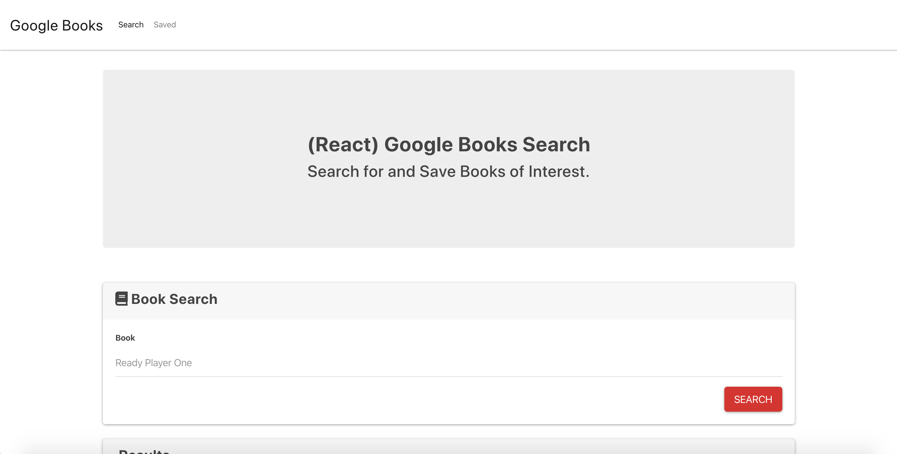
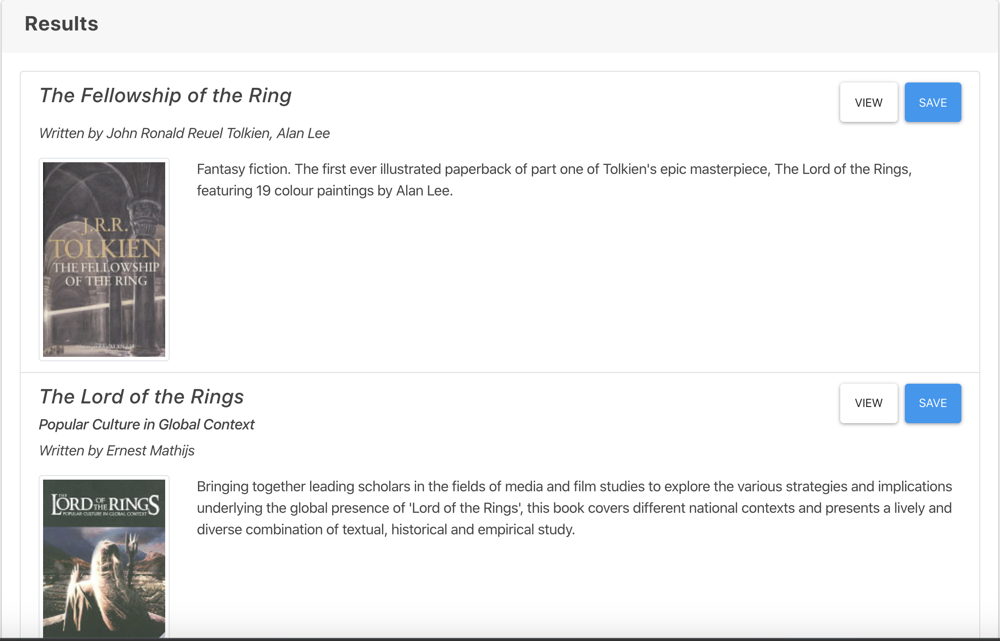
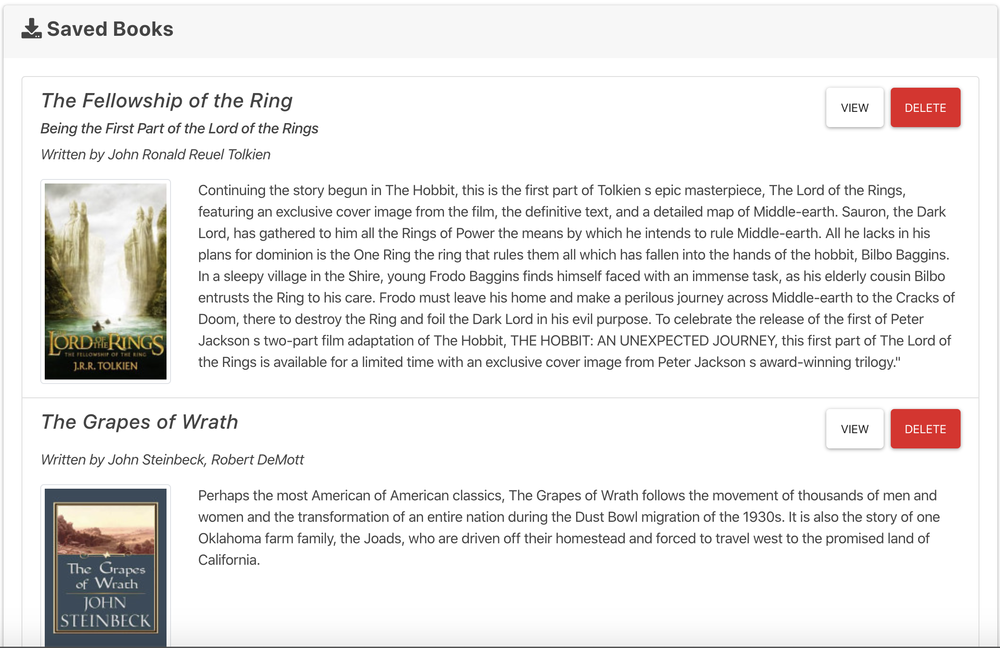

# googlebooks
https://blooming-hollows-76107.herokuapp.com/
## Overview
The Google Book application is a simple MERN application. In it, the user can search for a book an recieve information regarding that particular book or series. The user can also save books.

## How It Works
When the user enters the page, they will be presented with a search bar to input the name of the book they would like more information on. After inputting a book, they will click search and the application with search Google Books for the corresponding information. Once the information is displayed, the user can save a book and it will stay on their Saved page. 

## Technologies Used
This is a MERN application. It uses React, Node, Express, MongoDB, a couple of NPM packages.

## Role
This is a solo project. As the only developer, I analyzed and interpreted the needs, wants, and requirements of the Product Owner (Trilogy) and created a functioning application from top to bottom that met those expectations.

## Screenshots

